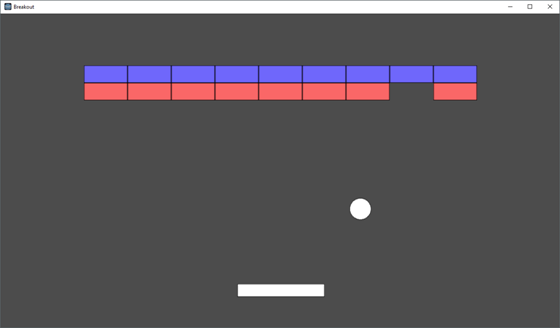

## Breakout - Part 2

Nolan is impressed! You have built your first prototype of the game and it is starting to come together beautifully.

Local game review sites gamespot and IGN have rated your game preview a 9 out of 10! The hype for your game is motivating the team to work extra hours!

## Step 1 - Resource Manager

Nolan thinks the game may be running on more resource constrained machines than originally intended. He would like a Singleton class for a resource manager. He nods and agrees that you can look to "lab 4" for inspiration.

## Step 2 - Frame Capping
The breakout game should be framecapped now to 60fps as the number of machines we are targeting has grown.

## Step 3 - More Levels
The main complaint from gamespot and IGN was that the game was too short. In order to combat this, there should now be at least three levels.

Nolan is requiring that the levels are created from some sort of configuration script in case more are asked for later. That means, your game must not have any of the levels hardcoded.

## Step 4 - Localization
The light bulb also goes off as Nolan is discussing the idea of configuration files for the levels. He decides breakout should be played by everyone in North America--no the world!

Nolan wants all strings in your game (e.g. "score", "level", etc.) to be loaded from a separate file. You will now support at least two languages of your choice. (e.g. English and French, English and Japanese, English and Hindi, etc.)

## Part 2 - Game Requirements (Summary)

### Part 2 - Rubric (5% of overall grade)

* (25%) There are at least 3 levels in the game
* (25%) The game is frame capped to 60 FPS
* (25%) A 'level loading' system is built in (No hard coded variables for loading levels!).
* (25%) All strings are loaded from a configuration file for the English Language and one other language of your choice. You may use google translate as required.

## Part 1 - Game Requirements (Summary)

The breakout game you are building in part 1 has the following requirements.

- There is at least one level with blue bricks with 4 rows of 12 bricks.
- The User interface displays the number of "lives" available (3 to start)
- The User interface displays the score, correlating to how many bricks have been removed
- You have a paddle, that is controlled with either:
  - The left and right arrow keys (To move the paddle left and right respectively)
  - 'a' and 'd' keys  (To move the paddle left and right respectively)
- When the ball collides with the paddle, it should change velocity in the opposite direction.
  - You may choose to make use of, or add to your TinyMath.h to handle things like collision, Vectors of different dimensions, etc.
  - A sound clip should play
- When the user hits 'q' the program terminates.
- When all blocks are removed, the game should pause and display "You win!" (Or something equally enthusiastic).
- If all lives are lost, the game should pause and display "You Lose!" (Or something equally sad).
- There should be a music track looping in the background.

Beyond those requirements, you may get as creative as you like.

Tips:
* Think about good object-oriented programming style
  * (Nolan Bushnell changes his mind a lot--because the game industry moves fast! I wonder what will happen in part 2?)
* Special effects and cool features are encouraged!

### Part 1 - Rubric (5% of overall grade)

* (50%) The Game requirements should be met above.
* (50%) The game should feel polished
